# jqui-mfd-Widgets für vis-2

Die jqui-mfd-Widgets sind 27 Knöpfe mit den Symbolen des
[OpenAutomation-Iconsets](https://github.com/OpenAutomationProject/knx-uf-iconset) für Licht, Steckdosen, Rollläden,
Markisen, Ventile, Fenster, Türen, die Heizung und Kameras. Viele öffnen einen Dialog, mit dem das Gerät gesteuert
wird. Diese Seite beschreibt die Version für **vis-2**. vis (vis-1) hat dieselben Widgets mit denselben
Einstellungen.

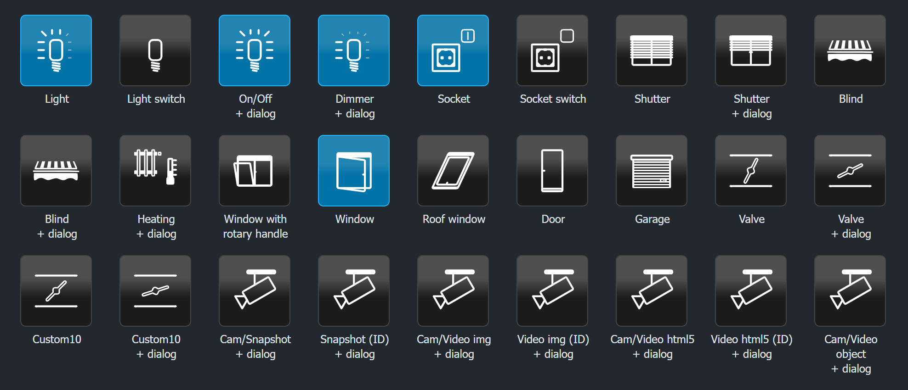

**Inhalt**

- [Allgemeines](#allgemeines)
    - [Voraussetzungen und Migration](#voraussetzungen-und-migration)
    - [vis-2-Design oder vis-1-Aussehen](#vis-2-design-oder-vis-1-aussehen)
    - [Der Knopf und das jQuery-UI-Theme](#der-knopf-und-das-jquery-ui-theme)
    - [Symbole und Symbolfarben](#symbole-und-symbolfarben)
    - [Werte im Editor](#werte-im-editor)
    - [Dialoge](#dialoge)
- [Licht/Dimmer, Lichtschalter, Dimmer + Dialog](#lichtdimmer-lichtschalter-dimmer--dialog)
- [An/Aus + Dialog](#anaus--dialog---tplmfdlightonoffdialog)
- [Steckdose und Steckdosenschalter](#steckdose-und-steckdosenschalter)
- [Rollladen, Markise, Ventil](#rollladen-markise-ventil)
- [Custom10](#custom10---tplmfdcustom10-tplmfdcustom10dialog)
- [Heizung + Dialog](#heizung--dialog---tplmfdheating)
- [Fenster, Dachfenster, Garage](#fenster-dachfenster-garage)
- [Tür](#tür---tplmfddoor)
- [Fenster mit Drehgriff](#fenster-mit-drehgriff---tplmfdwindow)
- [Kameras](#kameras)
- [Unterschiede zu vis-1](#unterschiede-zu-vis-1)

## Allgemeines

### Voraussetzungen und Migration

Die Widgets stehen im vis-2-Editor in der Widget-Liste unter dem Satz **jQuery UI MFD**. Sie brauchen **vis-2
2.12.8** oder neuer.

Projekte aus vis-1 funktionieren ohne Änderungen weiter. Beide Versionen verwenden dieselben Widget-IDs
(`tplMfdLight`, `tplMfdShutterDialog`, ...) und dieselben Attributnamen, und vis-2 nimmt automatisch die
React-Version. Alle Einstellungen bleiben erhalten.

In den Tabellen unten ist **Einstellung** die Beschriftung im vis-2-Editor und **Attribut** der Name, unter dem der
Wert im Projekt gespeichert wird. Den Attributnamen brauchen Sie, wenn Sie ein Projekt als JSON bearbeiten oder
Einstellungen zwischen Widgets kopieren.

### vis-2-Design oder vis-1-Aussehen

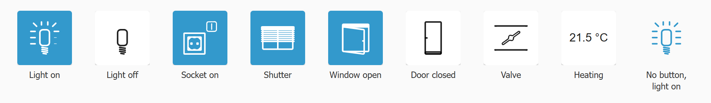

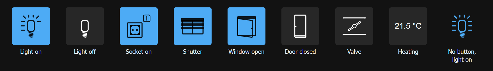

| Einstellung | Attribut | Standard | Beschreibung |
|---|---|---|---|
| vis-2-Design | `mui` | an (neue Widgets) | Zeichnet das Widget in den Farben des vis-2-Designs: Der Knopf ist eine Fläche des Designs, gedrückt nimmt er die Primärfarbe an, das Symbol die Textfarbe. Die Dialoge verwenden dieselben Farben. Aus: das jQuery-UI-Aussehen von vis-1, siehe [unten](#der-knopf-und-das-jquery-ui-theme). |

Jedes in vis-2 angelegte Widget hat diese Option eingeschaltet und folgt dem Design von vis-2 - hell, dunkel oder
jedem anderen. Widgets aus vis-1 - und Widgets, die mit einer älteren Version dieses Adapters angelegt wurden - haben
**keinen Wert** dafür und behalten das vis-1-Aussehen, ein bestehendes Projekt ändert sich also nicht. Der Editor
zeigt einen solchen fehlenden Wert als Standardwert an, also angehakt, und markiert das Feld rot: Haken Sie das
Kästchen einmal ab und wieder an, um das Widget auf das vis-2-Design umzustellen.

Mit dem vis-2-Design:

- Die Symbole nehmen die Textfarbe des Designs an - dunkel im hellen Design, weiß im dunklen. Auf einem gedrückten
  Knopf nehmen sie die Textfarbe der Primärfarbe an; ohne *Knopf-Viereck* zeigt ein Widget, das an oder offen ist,
  sein Symbol in der Primärfarbe. Eine eingestellte *Symbolfarbe* hat immer Vorrang.
- *Symbol invertieren* wird nicht gebraucht; lassen Sie es aus.
- Das jQuery-UI-Theme der View wirkt auf diese Widgets nicht.

| Helles Design | Dunkles Design |
|---|---|
| 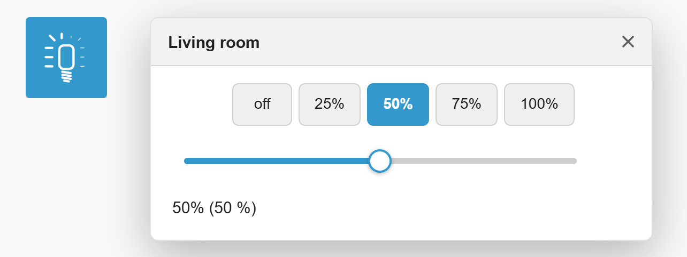 | 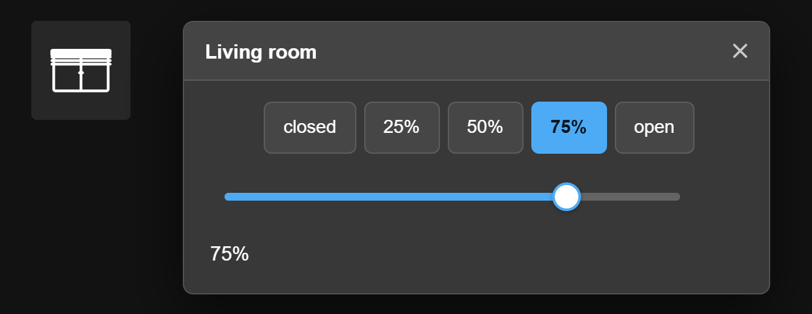 |

### Der Knopf und das jQuery-UI-Theme

Jedes Widget ist ein Symbol auf einem Knopf. Im vis-1-Aussehen (*vis-2-Design* aus oder nicht gesetzt) zeichnet den
Knopf das **jQuery-UI-Theme der View** (View-Einstellungen, *Theme*), genau wie in vis-1: Das Widget trägt die Klassen
`ui-widget ui-button ui-corner-all ui-state-default`, und das Theme bestimmt Farben, Verlauf und Ecken. Wechseln Sie
das Theme, ändern sich alle Knöpfe mit.

| redmond | ui-lightness | dark-hive | ui-darkness |
|---|---|---|---|
| 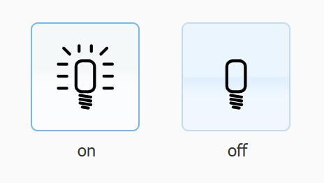 | 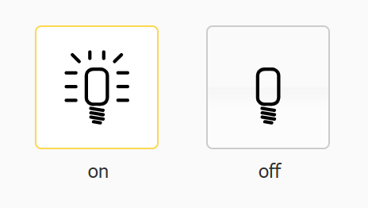 | 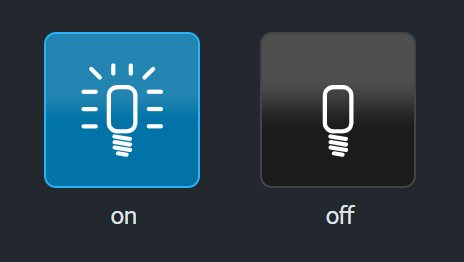 | 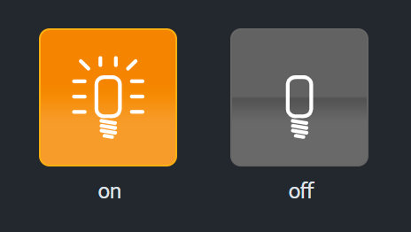 |

Die Symbole sind weiß. Auf einem hellen Theme wie *redmond* schalten Sie **Symbol invertieren** ein oder wählen eine
**Symbolfarbe**.

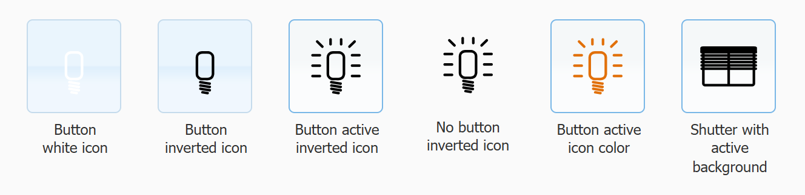

| Einstellung | Attribut | Standard | Beschreibung |
|---|---|---|---|
| Knopf-Viereck | `asButton` | an | Zeichnet den Knopf - des jQuery-UI-Themes oder des vis-2-Designs. Aus: nur das Symbol. |
| Symbol invertieren | `invert_icon` | aus | Invertiert das Symbol: aus Weiß wird Schwarz. |

**Gedrückt und Hover.** Der Knopf erscheint gedrückt (`ui-state-active`), solange das Gerät an oder offen ist - die
Lampe leuchtet, die Steckdose ist an, das Fenster ist offen. Widgets, die auf einen Klick reagieren, leuchten
außerdem unter der Maus auf (`ui-state-hover`). Die Tabellen der Widgets sagen, wann ein Widget gedrückt ist.

Eine CSS-Klasse aus den allgemeinen Einstellungen des Widgets landet am Knopf, eigene CSS-Regeln funktionieren also
weiter.

### Symbole und Symbolfarben

Die Symbole sind SVG-Bilder und bleiben bei jeder Widget-Größe scharf. Die Standardgröße eines Widgets ist
76 x 76 px. Lampe, Rollladen, Markise und Ventil sind gar keine Bilder: Sie werden für den genauen Wert gezeichnet,
37% zeigen also wirklich 37%.

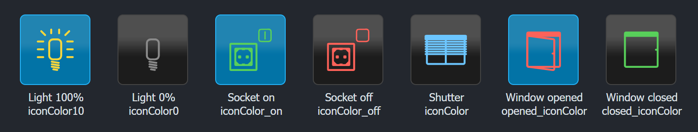

| Einstellung | Attribut | Beschreibung |
|---|---|---|
| Symbolfarbe | `iconColor` | Farbe des Symbols, zum Beispiel `#e17009` oder `orange`. Leer: weiß. |
| Symbolfarbe bei 0% ... bei 100% | `iconColor0` ... `iconColor10` | Farben der Widgets, die einen Wert zeigen (Licht, Rollladen, Ventil, Markise), jeweils für einen Bereich des Werts: `iconColor0` unter 10%, `iconColor1` ab 10%, ..., `iconColor10` bei *Max* - die Stufen der vis-1-Bilder. Eine leere nimmt die *Symbolfarbe*. |

Eine Farbe ersetzt das Weiß des Symbols. Auch eigene Symbole lassen sich einfärben, wenn es SVG-Bilder in Weiß sind.
Andere Bilder (PNG, JPG) erscheinen unverändert.

### Werte im Editor

*Min*, *Max* und die Werte von Zuständen (*Wert für AUF*, *Wert für AN*, ...) werden als Text eingegeben. Die
Widgets wandeln sie so um:

| Eingegebener Text     | Bedeutung |
|-----------------------|-----------|
| `true` / `false`      | Boolean `true` / `false` |
| `0`, `1`, `42.5`, ... | Zahl |
| alles andere          | der Text unverändert |
| (leer)                | der Standardwert der Einstellung |

Ein Wert des Datenpunkts und ein eingestellter Wert werden locker verglichen: `1`, `"1"` und `true` sind gleich.

### Dialoge

Die Widgets mit *+ Dialog* im Namen öffnen beim Klick einen Dialog. Der Dialog liegt über der ganzen View, lässt sich
an der Titelleiste verschieben und schließt mit dem **x**, mit **Escape** oder - wenn eingestellt - von selbst. Er
verwendet die Farben des vis-2-Designs - mit *vis-2-Design* aus hat er ein eigenes helles oder dunkles Aussehen. Im
Editor öffnen sich die Dialoge nicht, ein Klick wählt das Widget aus.

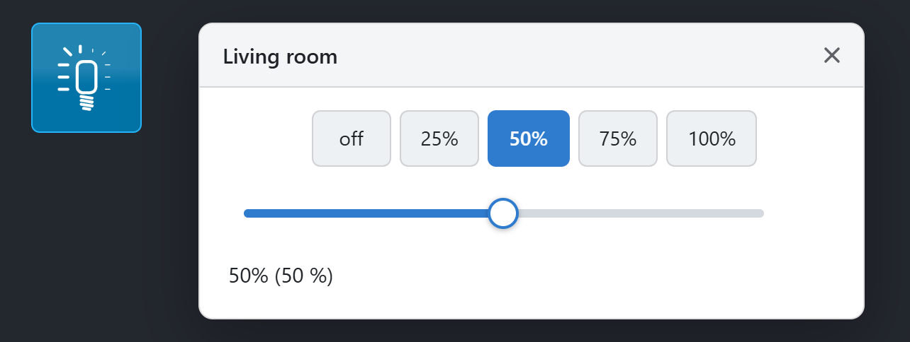

| Einstellung | Attribut | Standard | Beschreibung |
|---|---|---|---|
| Dialogtitel | `title` | | Text der Titelleiste. Leer: die Objekt-ID (Kameras: kein Titel). |
| Ohne Titelleiste | `noHeader` | aus | Blendet die Titelleiste aus. Der Schließen-Knopf bleibt. |
| Automatisch schließen (ms) | `autoclose` | | Schließt den Dialog nach dieser Zeit. Jeder Klick in den Dialog startet die Zeit neu. Werte unter 60 gelten als Sekunden. Leer oder 0: Der Dialog bleibt offen. |
| Modal | `modal` | aus | Verdunkelt die View hinter dem Dialog. Ein Klick auf die dunkle Fläche schließt den Dialog. |
| Dialogbreite | `dialog_width` | siehe Widget | Breite. Eine Zahl sind px, `50%` oder `30em` gehen auch. |
| Dialoghöhe | `dialog_height` | siehe Widget | Mindesthöhe. Der Dialog wächst mit seinem Inhalt. |
| Dialog oben / Dialog links | `dialog_top` / `dialog_left` | | Position im Fenster, zum Beispiel `20` oder `10%`. Leer: zentriert. |
| Überlauf X / Überlauf Y | `overflowX` / `overflowY` | | Bildlaufleisten des Inhalts: `visible`, `hidden`, `scroll`, `auto`, ... |

Der Dialog wird nie größer als das Fenster. Nicht jeder Dialog hat alle Einstellungen, die Tabellen der Widgets
nennen die Unterschiede.

**Die Wert-Dialoge** (Dimmer, Rollladen, Markise, Ventil, Custom10, Heizung) haben eine Reihe Knöpfe für feste
Werte, einen Schieberegler und eine Zeile mit dem Wert:

| Einstellung | Attribut | Beschreibung |
|---|---|---|
| Wert zeigen | `show_value` | Ergänzt die Zeile um den Wert selbst, z. B. `42% (42 %)`. |
| Einheit | `units` | Einheit hinter dem Wert. |
| Objekt-ID für 'in Arbeit' | `oid-working` | Ein Objekt, das `true` ist, solange das Gerät fährt, z. B. `WORKING` eines HomeMatic-Rollladenaktors. Solange es `true` ist, bleibt der Schieberegler dort, wo Sie ihn losgelassen haben, statt den Zwischenpositionen zu folgen, die das Gerät unterwegs meldet. |

Der Schieberegler schreibt den Wert einmal, wenn Sie ihn loslassen. Der Knopf des aktuellen Werts ist hervorgehoben.

## Licht/Dimmer, Lichtschalter, Dimmer + Dialog

`tplMfdLight`, `tplMfdLightCtrl`, `tplMfdLightDialog`

Die Lampe zeigt die Helligkeit ohne Stufen: Unter 1% des Bereichs ist sie aus, darüber leuchten die Strahlen
nacheinander auf, im Uhrzeigersinn von links unten - alle 10% einer mehr, der dazwischen wächst.

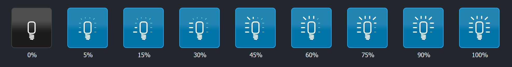

- **Licht/Dimmer** (`tplMfdLight`) zeigt nur den Zustand.
- **Lichtschalter** (`tplMfdLightCtrl`) schaltet beim Klick: von *Min* auf *Max*, von *Max* auf *Min*. Ein Wert
  dazwischen geht ab der Mitte des Bereichs auf *Min*, darunter auf *Max*. Ohne *Min* und *Max* schaltet er zwischen
  `false` und `true` (eine Zahl: ab 0,5 auf `0`, darunter auf `1`). **Für einen Dimmer von 0 bis 100 tragen Sie
  *Min* = 0 und *Max* = 100 ein.**
- **Dimmer + Dialog** (`tplMfdLightDialog`) öffnet einen Dialog mit *aus / 25% / 50% / 75% / 100%* des Bereichs und
  einem Schieberegler von *Min* bis *Max* in Schritten von 1%.

| Einstellung | Attribut | Standard | Beschreibung |
|---|---|---|---|
| Objekt-ID | `oid` | | Zustand der Lampe. `true` gilt als *Max*, `false` als *Min*. |
| Min / Max | `min` / `max` | 0 / 100 | Bereich des Werts. Der Lichtschalter nimmt sie als Aus-/An-Wert, siehe oben. |
| Symbol invertieren, Knopf-Viereck, Symbolfarbe | | | Siehe [Allgemeines](#allgemeines). |
| Symbolfarbe bei 0% ... 100% | `iconColor0` ... `iconColor10` | | Farbe je 10% des Bereichs, `iconColor0` auch für die ausgeschaltete Lampe. |
| Objekt-ID für 'in Arbeit' | `oid-working` | | Nur Dimmer + Dialog, siehe [Dialoge](#dialoge). |
| Dialog-Einstellungen | | 470 x 210 | Nur Dimmer + Dialog, siehe [Dialoge](#dialoge), mit *Wert zeigen* und *Einheit*. |

Der Knopf ist gedrückt, solange der Wert über *Min* liegt. Lichtschalter und Dimmer leuchten unter der Maus auf.

## An/Aus + Dialog - `tplMfdLightOnOffDialog`

Eine Lampe, die einen Dialog mit den zwei Knöpfen *aus* und *an* öffnet.

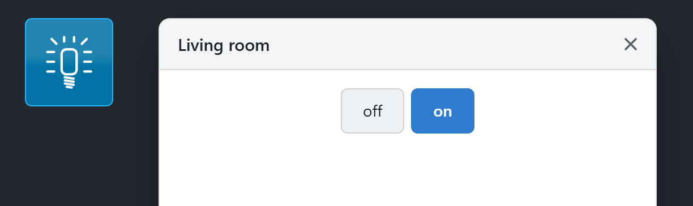

| Einstellung | Attribut | Standard | Beschreibung |
|---|---|---|---|
| Objekt-ID | `oid` | | Zu schaltender Zustand. |
| Objekt-ID für 'in Arbeit' | `oid-working` | | Wird von diesem Widget nicht verwendet. |
| Min / Max | `min` / `max` | 0 / 100 | Werte, die die Knöpfe *aus* und *an* schreiben. **Für einen Boolean-Zustand tragen Sie `false` und `true` ein.** |
| Symbol für AUS / Symbol für AN | `iconOff` / `iconOn` | ausgeschaltete / leuchtende Lampe | Eigene Bilder für beide Zustände. |
| Symbolfarbe für AUS / für AN | `iconColorOff` / `iconColorOn` | | Farben der beiden Symbole. |
| Symbol invertieren, Knopf-Viereck | | | Siehe [Allgemeines](#allgemeines). |
| Text für AUS / Text für AN | `textOff` / `textOn` | *aus* / *an* | Beschriftung der beiden Knöpfe. |
| Dialog-Einstellungen | | 440 x 200 | Siehe [Dialoge](#dialoge). |

Die Lampe ist an - Symbol *an*, Knopf gedrückt -, wenn der Zustand gleich *Max* ist (wenn *Max* eingetragen ist),
wenn er sich von *Min* unterscheidet (wenn nur *Min* eingetragen ist), sonst wenn er nicht `false`, `0`, `off` oder
leer ist.

## Steckdose und Steckdosenschalter

`tplMfdSocket`, `tplMfdSocketCtrl`

Eine Steckdose, die ihren Zustand zeigt; die Schalter-Version schaltet sie beim Klick.

| Einstellung | Attribut | Standard | Beschreibung |
|---|---|---|---|
| Objekt-ID | `oid` | | Zustand der Steckdose. |
| Min / Max | `min` / `max` | 0 / 1 | Aus- und An-Wert. Die Steckdose ist an, solange der Zustand nicht *Min* ist. `true` gilt als *Max*, `false` als *Min*. |
| Zustand invertieren | `invert_state` | aus | Vertauscht an und aus, für einen Zustand, der `true` ist, wenn die Steckdose aus ist. |
| Symbol für AUS / Symbol für AN | `icon_off` / `icon_on` | Steckdosenbilder | Eigene Bilder für beide Zustände. |
| Symbolfarbe für AUS / für AN | `iconColor_off` / `iconColor_on` | | Farben der beiden Symbole. |
| Symbol invertieren, Knopf-Viereck | | | Siehe [Allgemeines](#allgemeines). |

Der Knopf ist gedrückt, solange die Steckdose an ist.

**Steckdosenschalter** (`tplMfdSocketCtrl`) schaltet beim Klick wie der Lichtschalter: zwischen *Min* und *Max*,
ohne sie zwischen `false` und `true`. Er leuchtet unter der Maus auf. Die Gruppe **Steuerung** ersetzt das durch
andere Aktionen:

| Einstellung | Attribut | Beschreibung |
|---|---|---|
| URL für AN / URL für AUS | `urlTrue` / `urlFalse` | Diese URLs werden beim Ein- bzw. Ausschalten aufgerufen. Der ioBroker-Server ruft sie auf, nicht der Browser. Leere *URL für AUS*: die URL für AN. |
| Objekt-ID für AN / für AUS | `oidTrue` / `oidFalse` | Diese Objekte werden beim Ein- bzw. Ausschalten geschrieben, statt der Objekt-ID. Leere *Objekt-ID für AUS*: das Objekt für AN. |
| Wert für AN / Wert für AUS | `oidTrueValue` / `oidFalseValue` | Die Werte, die hineingeschrieben werden. Leer: *Max* oder `true`, *Min* oder `false`. |

Mit URLs oder Objekten für AN/AUS und **ohne** Objekt-ID merkt sich das Widget seinen Zustand selbst - nach dem Neuladen
der Seite beginnt es mit aus.

## Rollladen, Markise, Ventil

`tplMfdShutter`, `tplMfdShutterDialog`, `tplMfdBlind`, `tplMfdBlindDialog`, `tplMfdValve`, `tplMfdValveDialog`

Zeigen eine Position, gezeichnet für den genauen Wert; die Dialog-Versionen stellen sie ein.

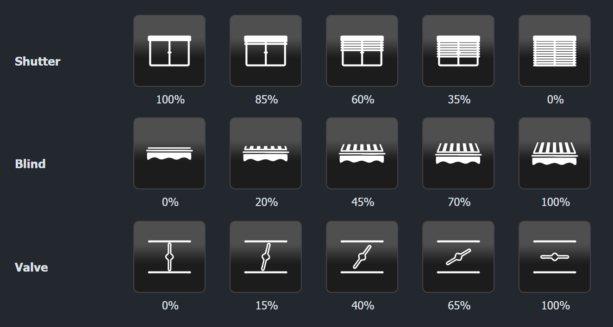

- **Rollladen**: bei *Max* das offene Fenster, je kleiner der Wert, desto weiter kommen die Lamellen aus dem
  Kasten.
- **Markise**: von eingefahren (*Min*) bis ausgefahren (*Max*); das Tuch wächst, die Vorderkante wandert nach unten.
- **Ventil**: Die Klappe dreht sich von senkrecht - zu (*Min*) - bis parallel zum Rohr - offen (*Max*).

| Einstellung | Attribut | Standard | Beschreibung |
|---|---|---|---|
| Objekt-ID | `oid` | | Position, z. B. `LEVEL`. |
| Min / Max | `min` / `max` | 0 / 100 | Bereich. |
| Wert invertieren | `invert_value` | aus | Für Geräte, die die andere Richtung melden, z. B. 100 = Rollladen zu. Kehrt auch den Schieberegler um und vertauscht die Werte der Dialog-Knöpfe. |
| Aktiven Hintergrund zeigen | `show_active` | aus | Der Knopf ist gedrückt, solange der Wert nicht *Max* ist (der Rollladen nicht ganz offen), und leuchtet unter der Maus auf. |
| Symbol invertieren, Knopf-Viereck, Symbolfarbe | | | Siehe [Allgemeines](#allgemeines). |
| Symbolfarben | `iconColor0` ... `iconColor10` | | Farbe je 10% des Bereichs, siehe [Symbole und Symbolfarben](#symbole-und-symbolfarben). Die Markise hat fünf: `iconColor0` (unter 25%), `iconColor25`, `iconColor5` (ab 50%), `iconColor75`, `iconColor10` (bei *Max*). |
| Objekt-ID für 'in Arbeit' | `oid-working` | | Nur Dialog-Versionen, siehe [Dialoge](#dialoge). |
| Dialog-Einstellungen | | 450 x 210 (Ventil 440 x 200) | Nur Dialog-Versionen, siehe [Dialoge](#dialoge), mit *Wert zeigen* und *Einheit*. |

Der Dialog hat die Knöpfe *zu / 25% / 50% / 75% / auf* (*Min* ... *Max*) und einen Schieberegler.

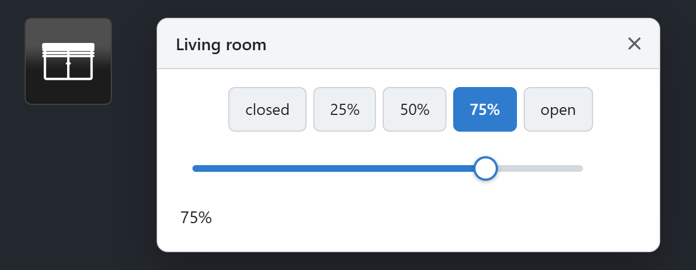

## Custom10 - `tplMfdCustom10`, `tplMfdCustom10Dialog`

Elf eigene Bilder. Voreingestellt sind die Ventil-Bilder.

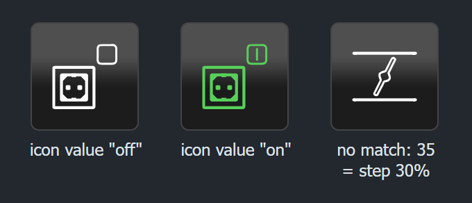

Für jede Stufe 0 ... 10 gibt es in der Gruppe **Symbole** drei Einstellungen:

| Einstellung | Attribut | Beschreibung |
|---|---|---|
| Symbolwert für N% | `iconValue0` ... `iconValue10` | Hat der Zustand genau diesen Wert (`1` passt auch zu `"1"`), wird dieses Bild gezeigt. |
| Symbol für N% | `icon0` ... `icon10` | Das Bild. |
| Symbolfarbe bei N% | `iconColor0` ... `iconColor10` | Farbe des Bildes, siehe [Symbole und Symbolfarben](#symbole-und-symbolfarben). |

Das Widget sucht zuerst eine Stufe, deren *Symbolwert* gleich dem Zustand ist. Gibt es keine, nimmt es die Stufe des
Bereichs wie das Ventil: `icon0` unter 10% des Bereichs zwischen *Min* und *Max*, `icon1` ab 10%, ..., `icon10` bei
*Max*. `true` gilt als *Max*, `false` als *Min*.

Die übrigen Einstellungen - *Objekt-ID*, *Min*, *Max*, *Knopf-Viereck*, *Wert invertieren*, *Aktiven Hintergrund
zeigen* und bei der Dialog-Version die Dialog-Einstellungen (440 x 200) - funktionieren wie beim
[Ventil](#rollladen-markise-ventil). Custom10 hat kein *Symbol invertieren* und keine *Symbolfarbe*.

## Heizung + Dialog - `tplMfdHeating`

Ein Thermostat. Der Heizkörper - oder die Temperatur als Text - öffnet einen Dialog mit einem Knopf je Temperatur und
einem Schieberegler.

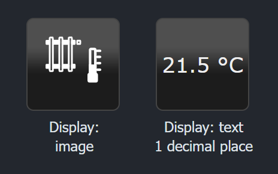

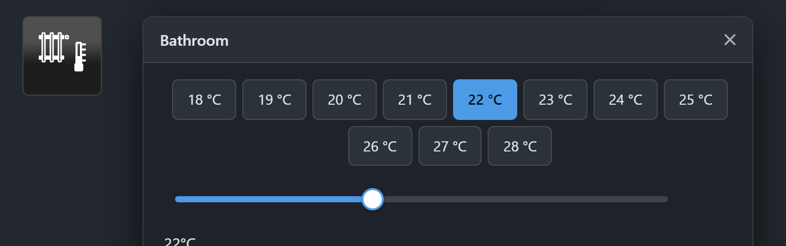

| Einstellung | Attribut | Standard | Beschreibung |
|---|---|---|---|
| Objekt-ID | `oid` | | Soll-Temperatur. |
| Objekt-ID für 'in Arbeit' | `oid-working` | | Siehe [Dialoge](#dialoge). |
| Min / Max / Schritt | `min` / `max` / `step` | 18 / 30 / 2 | Die Knöpfe des Dialogs gehen von *Min* bis *Max* in *Schritt*; der Schieberegler nimmt dieselben Werte. Höchstens 100 Knöpfe werden gezeigt. |
| Nachkommastellen | `roundnumber` | 0 | Nachkommastellen der Knöpfe und der Texte. |
| Anzeige | `checkboxDisplay` | Bild | `image`: das Heizkörper-Symbol. `text`: die Temperatur, z. B. `21.5 °C`. |
| Symbol invertieren, Knopf-Viereck, Symbolfarbe | | | Siehe [Allgemeines](#allgemeines). |
| Dialog-Einstellungen | | 600 x 200 | Siehe [Dialoge](#dialoge), ohne Position und Überlauf. |

Die Heizung erscheint nie gedrückt.

## Fenster, Dachfenster, Garage

`tplMfdWindowBool`, `tplMfdRoofWindowBool`, `tplMfdGarage`

Ein Kontakt mit den Zuständen zu und auf.

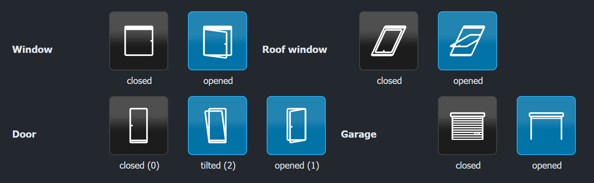

| Einstellung | Attribut | Standard | Beschreibung |
|---|---|---|---|
| Objekt-ID | `oid` | | Zustand des Kontakts. |
| Zustand invertieren | `invert_state` | aus | Vertauscht auf und zu. |
| Symbol invertieren, Knopf-Viereck, Symbolfarbe | | | Siehe [Allgemeines](#allgemeines). |
| Wert für ZU / Wert für AUF | `closed_value` / `opened_value` | | Ohne *Wert für AUF* ist jede Zahl über 0 und `true` offen. Mit ihm ist nur genau dieser Wert offen, alles andere zu. |
| Symbol für ZU / für AUF | `closed_icon` / `opened_icon` | Fenster, Dachfenster, Garagentor | Eigene Bilder. |
| Symbolfarbe für ZU / für AUF | `closed_iconColor` / `opened_iconColor` | | Farben je Zustand. Leer: *Symbolfarbe*. |

Der Knopf ist gedrückt, solange offen ist.

## Tür - `tplMfdDoor`

Eine Tür mit den drei Zuständen zu, gekippt und auf (siehe Bild oben).

| Einstellung | Attribut | Standard | Beschreibung |
|---|---|---|---|
| Objekt-ID | `oid` | | Zustand der Tür. `true` ist auf, `false` und kein Wert sind zu. |
| Zustand invertieren | `invert_state` | aus | Vertauscht nur das Gedrückt-Aussehen des Knopfs, nicht das Bild. |
| Symbol invertieren, Knopf-Viereck, Symbolfarbe | | | Siehe [Allgemeines](#allgemeines). |
| Wert für ZU / GEKIPPT / AUF | `closed_value` / `tilted_value` / `opened_value` | 0 / 2 / 1 | Jeder andere Wert gilt als auf. |
| Symbole und Symbolfarben | `closed_icon`, `closed_iconColor`, `tilted_icon`, ... | | Eigene Bilder und Farben je Zustand. |

Der Knopf ist gedrückt, solange die Tür nicht zu ist.

## Fenster mit Drehgriff - `tplMfdWindow`

Ein Fenster mit einem oder zwei Flügeln, jeder mit einem Drehgriffsensor.

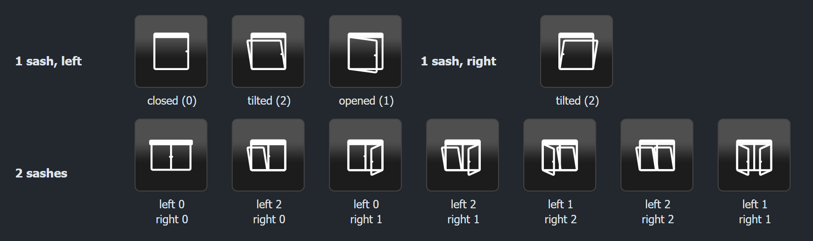

| Einstellung | Attribut | Standard | Beschreibung |
|---|---|---|---|
| Symbol invertieren, Knopf-Viereck, Symbolfarbe | | | Siehe [Allgemeines](#allgemeines). |
| Flügelanzahl | `slide_count` | 1 | Ein oder zwei Flügel. |
| Flügeltyp N | `slide_type1`, `slide_type2` | | `left` oder `right`: zu welchem Flügel der Sensor gehört. Bei einem Flügel spiegelt `right` das Fenster. |
| Flügelsensor N | `oid-slide-sensor1`, `oid-slide-sensor2` | | Zustand des Griffs dieses Flügels. |
| Wert für ZU / GEKIPPT / AUF | `closed_value` / `tilted_value` / `opened_value` | 0 / 2 / 1 | Werte der Sensoren. Bei einem Flügel ist `true` auf und `false` zu. |
| Symbole und Symbolfarben | `closed_icon`, `closed_iconColor`, `tilted_icon`, ... | | Eigene Bilder und Farben für das ganze Fenster. Das Fenster gilt als auf, wenn ein Flügel offen ist, als gekippt, wenn einer gekippt ist. |

Bei zwei Flügeln müssen beide Flügeltypen gesetzt sein. Das Widget hat keine eigene Objekt-ID und erscheint nie
gedrückt.

## Kameras

`tplMfdCamSnapshot`, `tplValMfdCamSnapshot`, `tplMfdCamMjpg`, `tplValMfdCamMjpg`, `tplMfdCamVideo`,
`tplValMfdCamVideo`, `tplMfdCamVideoObject`

Ein Kamerasymbol, das das Bild oder das Video einer Kamera öffnet. Die Versionen *aus Objekt* (`tplVal...`) nehmen die
URL aus einem Datenpunkt statt aus einer Einstellung.

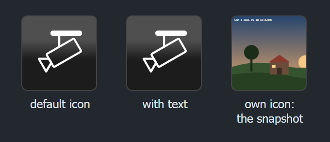

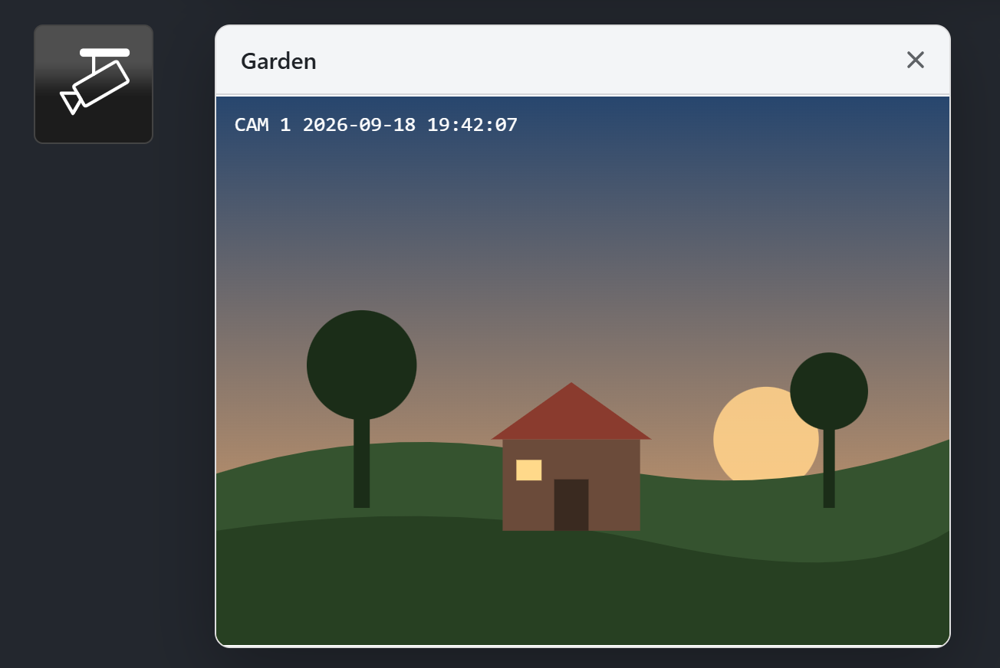

Gemeinsam für alle Kameras:

| Einstellung | Attribut | Standard | Beschreibung |
|---|---|---|---|
| Objekt-ID mit URL | `oid` | | Nur Versionen *aus Objekt*: Der Datenpunkt enthält die URL des Bildes oder Videos. |
| Alternativtext | `alt` | | Alternativtext des Symbols. |
| Text | `text` | | Text unter dem Symbol. |
| Knopf-Viereck, Symbolfarbe | | | Siehe [Allgemeines](#allgemeines). |
| Symbol | `icon` | Kamera | Eigenes Bild, z. B. die Schnappschuss-URL der Kamera, dann zeigt der Knopf das Bild. |
| Symbol invertieren | `invert_icon` | aus | Siehe [Allgemeines](#allgemeines). |
| Symbol-Updateintervall (ms) | `icon_interval` | | Lädt das eigene *Symbol* alle so viele ms neu. Leer oder 0: nie. |
| Dialog-Einstellungen | | 640 x 480 | Siehe [Dialoge](#dialoge). Das Bild füllt die Breite des Dialogs, die *Dialoghöhe* ist die Höhe des Bildes. Bildlaufleisten sind ausgeblendet, außer *Überlauf* ist gesetzt. |

Das Bild lädt nur, solange der Dialog offen ist.

| Widget | Eigene Einstellungen | Beschreibung |
|---|---|---|
| Kamera/Schnappschuss (`tplMfdCamSnapshot`) | `url`, `interval` (2000) | Lädt den Schnappschuss unter *URL* alle *Update-Intervall* ms neu, solange der Dialog offen ist. |
| Kamera/Schnappschuss aus Objekt (`tplValMfdCamSnapshot`) | `interval` (2000) | Dasselbe mit der URL aus dem Objekt. |
| Kamera/Video (img) (`tplMfdCamMjpg`) | `url` | Zeigt einen MJPEG-Stream. Der Stream endet, wenn der Dialog schließt, und startet neu, wenn die Seite aus dem Hintergrund zurückkommt. Dieser Dialog hat kein *Automatisch schließen*. |
| Kamera/Video (img) aus Objekt (`tplValMfdCamMjpg`) | | Dasselbe mit der URL aus dem Objekt, mit *Automatisch schließen*. |
| Kamera/Video (html5) (`tplMfdCamVideo`) | `src_url`, `poster_url`, `use_object` | Spielt das Video unter *Stream-URL* in einem HTML5-Player ab, bis zum Start erscheint die *Vorschaubild-URL*. *Object-Tag verwenden* bettet es stattdessen mit `<object>` ein. |
| Kamera/Video (html5) aus Objekt (`tplValMfdCamVideo`) | `poster_url`, `use_object` | Dasselbe mit der URL aus dem Objekt. |
| Kamera/Video (object) (`tplMfdCamVideoObject`) | `src_url`, `qtsrc_url`, `type_application` (video/quicktime), `plugin`, `autoplay` (true) | Bettet das Video für ein Browser-Plug-in (QuickTime) ein. Aktuelle Browser haben solche Plug-ins nicht mehr - nehmen Sie besser die html5-Version. |

## Unterschiede zu vis-1

Die React-Widgets verhalten sich wie die vis-1-Widgets. Das sind die Unterschiede:

- **vis-2-Design.** Neue Widgets folgen dem Design von vis-2 statt dem jQuery-UI-Theme, siehe
  [vis-2-Design oder vis-1-Aussehen](#vis-2-design-oder-vis-1-aussehen). Widgets aus vis-1 behalten ihr Aussehen,
  bis *vis-2-Design* eingeschaltet wird.

- **Keine jQuery-UI-Dialoge mehr.** Die Dialoge haben ein eigenes Aussehen, das dem hellen und dunklen Design von
  vis-2 folgt. Sie lassen sich verschieben, schließen mit *Escape*, und ein Klick auf die dunkle Fläche eines modalen
  Dialogs schließt ihn. Im Editor öffnen sie sich nicht.
- **Der Schieberegler schreibt einmal**, dort wo er losgelassen wird. vis-1 schickte bei jedem Schritt während der
  Bewegung einen Wert.
- **Automatisch schließen 0 bedeutet aus.** vis-1 schloss den Dialog mit 0 nach einer Sekunde.
- **Objekt-ID für 'in Arbeit' funktioniert.** vis-1 las das falsche Attribut und ignorierte sie.
- **Lampe, Rollladen, Markise und Ventil werden für den genauen Wert gezeichnet** statt eines von elf (Markise:
  fünf) Bildern zu zeigen - 37% zeigen nicht mehr das 30%-Bild. Bei 10%, 20%, ... entspricht die Zeichnung dem
  vis-1-Bild. Die Farben wechseln weiter in den Stufen von vis-1.
- **Symbolfarben erreichen jedes Symbol.** vis-1 färbte die Symbole mit `fill`-Attributen nicht ein, z. B. die
  ausgeschaltete Lampe, und verlor ein eigenes PNG-Symbol ganz, wenn eine Farbe gesetzt war. Die Symbole sind jetzt
  immer SVG.
- **Aktiven Hintergrund zeigen** bei Rollladen, Markise, Ventil und Custom10 vergleicht mit *Max* des Widgets. vis-1
  verglich mit 1, sodass ein Rollladen von 0 bis 100 fast immer gedrückt war.
- **Steckdosenschalter:** Das Gedrückt-Aussehen folgt *Zustand invertieren* wie das Symbol. Ohne Objekt-ID schaltet
  auch das Symbol um, nicht nur der Knopf.
- **Fenster mit Drehgriff:** Die eigenen Symbole je Zustand werden gezeigt. vis-1 bot sie an, ignorierte sie aber.
- **Dialog-Knöpfe** eines Boolean-Zustands werden hervorgehoben: `true` passt zu einem Knopf mit dem Wert `true` oder
  `1`.
- **Wert für AN/AUS** des Steckdosenschalters: Leer schreibt *Max*/*Min*. vis-1 schrieb einen leeren Text.
- **Heizung als Text** zeigt `--` statt `NaN`, solange es keinen Wert gibt.
- Die Versionen *aus Objekt* der Schnappschuss- und der MJPEG-Kamera bieten keine *URL* mehr an. Sie hatte in vis-1
  keine Wirkung.
